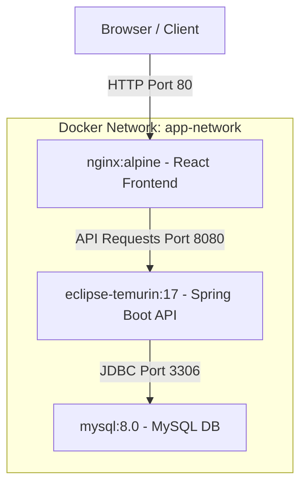

# Skill Gap Analyzer - Dockerization & Deployment Guide

This guide details the steps to build, orchestrate, deploy, and troubleshoot the **Skill Gap Analyzer** full-stack application using Docker and Docker Compose.

---

## 🏗️ Architecture Overview

The system consists of three main containerized services running on a private bridge network:



1. **Frontend Service (`frontend-web`)**:
   - Compiles React + TypeScript using Node 20.
   - Serves highly optimized, gzip-compressed static assets using Nginx.
   - Rewrites paths to support HTML5 React Router history URLs.
2. **Backend Service (`backend-api`)**:
   - Runs Spring Boot v3.3 application package on JRE 17 (Eclipse Temurin).
   - Dynamically resolves database credentials using environment variables.
   - Integrates healthcheck endpoints to ensure zero-downtime dependency chaining.
3. **Database Service (`mysql-db`)**:
   - Persistent MySQL 8.0 instance.
   - Stores user profiles, roles, and skill gap analyses.
   - Utilizes Docker Volumes to persist database schemas across container lifecycles.

---

## 📋 Prerequisites

Ensure you have the following software installed on the deployment host:

- **Docker** (v20.10.0 or later)
- **Docker Compose** (v2.0.0 or later) or Docker Desktop (Windows/macOS)
- **Git** (for code retrieval)

---

## 🚀 Quick Start Deployment

Deploy the entire stack with a single orchestration command:

### 1. Set Up Environment Variables
Copy the production environment variables template to `.env`:

```bash
# On Linux/macOS
cp .env.example .env

# On Windows PowerShell
Copy-Item .env.example .env
```

Review the `.env` file and customize passwords or ports if necessary. The default configuration is ready for immediate deployment on localhost:

```env
# Database Credentials
MYSQL_ROOT_PASSWORD=RootPassword
MYSQL_DATABASE=skill_gap_db
MYSQL_USER=skill_user
MYSQL_PASSWORD=SkillPassword
MYSQL_PORT=3306

# Backend Configuration
SPRING_PROFILES_ACTIVE=prod
SPRING_DATASOURCE_URL=jdbc:mysql://mysql-db:3306/skill_gap_db?useSSL=false&allowPublicKeyRetrieval=true
SPRING_DATASOURCE_USERNAME=root
SPRING_DATASOURCE_PASSWORD=RootPassword
BACKEND_PORT=8080

# Frontend Configuration
VITE_API_URL=http://localhost:8080
FRONTEND_PORT=80
```

### 2. Run the Docker Compose Stack
Boot the containers in detached (background) mode:

```bash
docker-compose up -d --build
```
> **Note**: For Docker Compose V2, you can also use `docker compose up -d --build`.

Docker will automatically pull the necessary base images, execute the multi-stage compilation for the frontend and backend, build the local images, and start the services in their correct order.

---

## 🔗 Exposed Access Endpoints

Once fully booted and healthy, you can access the system at the following URLs:

| Service | Access Endpoint | Internal Port | Host Port |
| :--- | :--- | :--- | :--- |
| **React Web App** | [http://localhost](http://localhost) | `80` | `80` |
| **Backend REST API** | [http://localhost:8080](http://localhost:8080) | `8080` | `8080` |
| **MySQL Database** | `localhost:3306` | `3306` | `3306` |

---

## 🛠️ Verification & Monitoring Commands

Verify container health and view runtime logs using the commands below:

### Check Service Status
See the status, uptime, and health checks of all containers:

```bash
docker-compose ps
```

Expected output:
```text
NAME                 IMAGE                         COMMAND                  SERVICE             STATUS              PORTS
skill_gap_mysql      mysql:8.0                     "docker-entrypoint.s…"   mysql-db            healthy             0.0.0.0:3306->3306/tcp, :::3306->3306/tcp
skill_gap_backend    skill-gap-analyzer-backend    "java -jar app.jar"      backend-api         healthy             0.0.0.0:8080->8080/tcp, :::8080->8080/tcp
skill_gap_frontend   skill-gap-analyzer-frontend   "/docker-entrypoint.…"   frontend-web        running             0.0.0.0:80->80/tcp, :::80->80/tcp
```

### View Application Logs
Stream log output for all services or target a specific service:

```bash
# View logs for all services
docker-compose logs -f

# Follow logs only for the backend
docker-compose logs -f backend-api

# Follow logs only for the MySQL database
docker-compose logs -f mysql-db
```

---

## ⚠️ Troubleshooting & Common Fixes

### 1. Database Connection Failures (Backend restarts continuously)
If the backend fails to connect to MySQL during initial boot:
- The MySQL database container takes ~10-15 seconds to initialize its storage engine on the first run.
- The `backend-api` service has a configured `depends_on` block with a MySQL `service_healthy` condition. It will automatically wait until the database responds to ping before starting.
- If it fails, check database logs with `docker-compose logs mysql-db` to see if there are permission/storage issues.

### 2. Changes in Frontend source files not reflecting
The React frontend is built statically inside the Docker image during the build phase.
If you update any React source files, you must rebuild the image:
```bash
docker-compose up -d --build frontend-web
```

### 3. Port Conflicts
If port `80`, `8080`, or `3306` is already in use by another program on your host machine:
1. Open `.env`.
2. Change the host port mappings (e.g., `FRONTEND_PORT=8082`, `BACKEND_PORT=8081`).
3. Re-run `docker-compose up -d`.

### 4. Cleaning the environment and starting fresh
To remove all containers, networks, and delete all persistent database volume data (this will delete all registered users!):

```bash
docker-compose down -v
```

To run a clean build afterwards:
```bash
docker-compose up -d --build --force-recreate
```

---

## ⚙️ Service Resource & Restart Policies
- **Restart Policy**: All services are configured with `restart: always` to ensure auto-recovery in the event of application failures or daemon reboots.
- **Volume Persistence**: MySQL stores databases under the host volume `/var/lib/mysql`, ensuring database entries survive restarts.
- **Nginx Caching**: Standard caching is configured inside `/etc/nginx/conf.d/default.conf` to serve static content instantly, with HTML headers set to `no-store` to prevent caching of outdated frontends.
